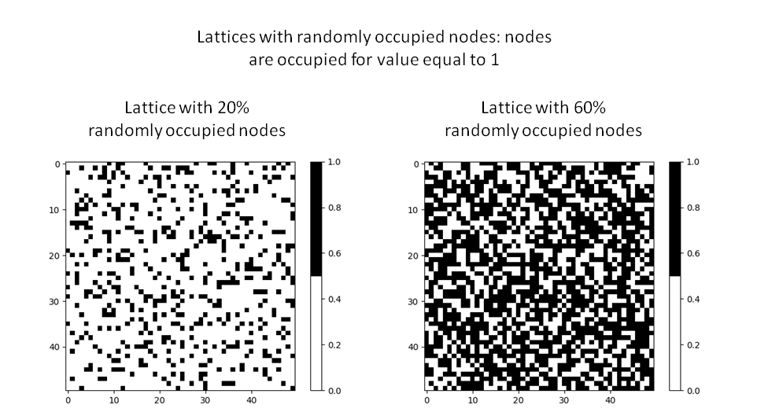
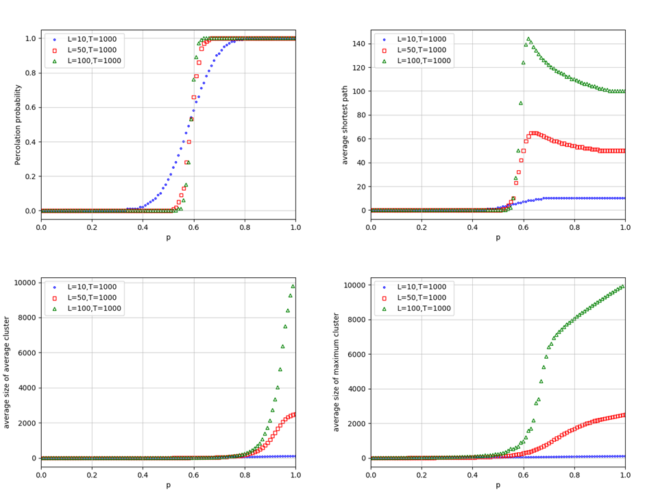

# Percolation problem

# General info
The site percolation problem on a square lattice and each site of a lattice is occupied independently with probability *p*. In Monte Carlo simulation, we investigate
* connection between the first and the last row: ***The Burning Method***
* distribution of clusters: ***Hoshen–Kopelman algorithm*** <br/>

<p align="center">
  
</p>

Code implementation has made in Python3.
Trials configurations of system was made by use pseudo-random numbers and advantage of Python is that core of
library generate random numbers use the Mersenne Twister generator which is really good for simulations.

# Results
1. plot_percolation_threshold.png -> probability that there is connection between two sides of lattice
2. plot_min_path.png -> the shortest path between two sides of lattice
3. plot_average_cluster.png -> average size of clusters
4. plot_maximum_cluster.png -> maximum size of clusters

<p align="center">
  
</p>

# Run
Because of different complexity of used algorithms, we run both methods separately (initial parameters: config.json)
```
python3 main.py --method burning
```
---------------------------------------
```
python3 main.py --method clustering
