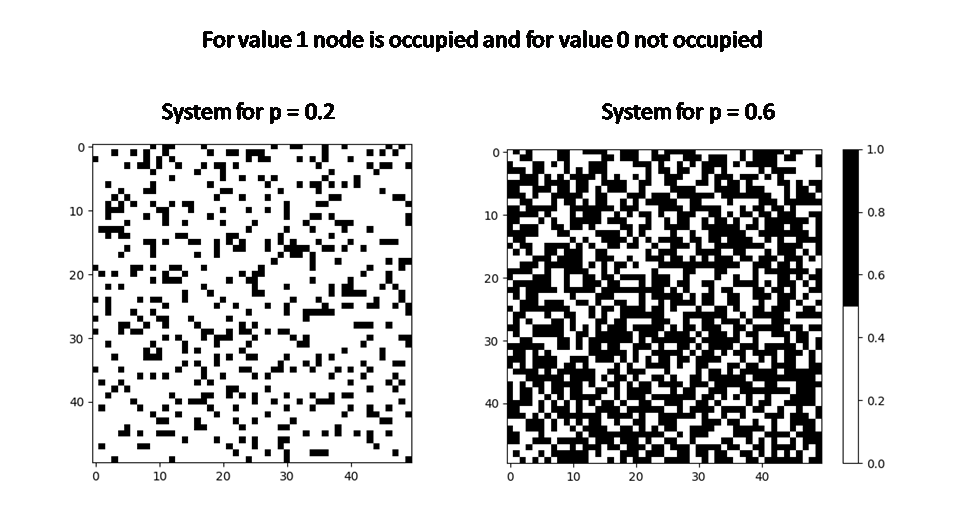

# Perlocation problem

# General info
The site percolation problem on a square lattice and ach site of a lattice is occupied independently with probability *p*. In Monte Carlo simulation, we investigate
* path connecting the first and the last row exists: The Burning Method
* distribution of clusters: Hoshen–Kopelman algorithm
Code implementation has made in Python3.
Trials configurations of system was made by use pseudo-random numbers and advantage of Python is that core of
library generate random numbers use the Mersenne Twister generator which is really good for simulations.

  

# Results

# Run
*perlocation.py* and *perc_ini.txt* after load initial data in .txt we can ran .py
by command python3 perlocation.py and there will by made all calculations

# Technologies
main.py is created with Python 3.7 and:
* NumPy
* Matplotlib
* random (Mersenne Twister generator)
